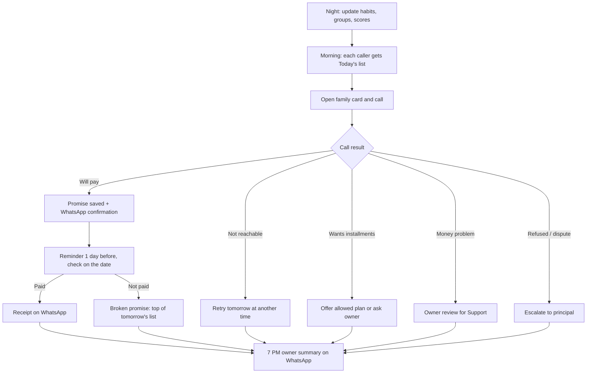

# School Fee Recovery System: Planning Document

> **What this is:** a plan for an app that helps a school owner or principal in India collect more of their school fees. It describes how the system should work. It contains no code.
>
> **Who it is for:** the school owner, the product team, and the developers who will build it later.
>
> **Design choices already made:**
> - India
> - Hindi + English app
> - ₹ in lakh format
> - April–March session
> - WhatsApp/SMS reminders and UPI payments
> - This app becomes the school's main fee register, starting with a one-time Excel import
> - Users: Owner/Principal, Accountant, Calling staff/Teachers, and Parents (parents get messages and links only, no login)

---

## Contents

1. [The problem and the goal](#1-the-problem-and-the-goal)
2. [The one big idea: Ability to pay × Payment habit](#2-the-one-big-idea-ability-to-pay--payment-habit)
3. [Payment habit types](#3-payment-habit-types)
4. [Ability-to-pay tagging](#4-ability-to-pay-tagging)
5. [Owner's home screen: what they see first](#5-owners-home-screen-what-they-see-first)
6. [Family card: what anyone sees before calling](#6-family-card-what-anyone-sees-before-calling)
7. [Daily recovery workflow](#7-daily-recovery-workflow)
8. [Offers and solutions toolkit](#8-offers-and-solutions-toolkit)
9. [Parent communication and payment](#9-parent-communication-and-payment)
10. [Fee register (accountant)](#10-fee-register-accountant)
11. ["How much can I recover?" (forecast)](#11-how-much-can-i-recover-forecast)
12. [Finding the missing money](#12-finding-the-missing-money)
13. [Reports](#13-reports)
14. [School-year calendar and campaigns](#14-school-year-calendar-and-campaigns)
15. [Roles and permissions](#15-roles-and-permissions)
16. [What the system keeps (conceptual data)](#16-what-the-system-keeps-conceptual-data)
17. [Keeping it simple (design rules)](#17-keeping-it-simple-design-rules)
18. [Trust, privacy and rules](#18-trust-privacy-and-rules)
19. [Rollout phases](#19-rollout-phases)
20. [How we'll know it works](#20-how-well-know-it-works)
21. [A day with the app](#21-a-day-with-the-app)
22. [Open questions for the build phase](#22-open-questions-for-the-build-phase)
- [Appendix: the owner's concerns and where each one is answered](#appendix-the-owners-concerns-and-where-each-one-is-answered)

---

## 1. The problem and the goal

**Today:**
- Owners know how much has been collected. They don't know **who can pay and isn't paying**.
- Staff effort is spread evenly. Families who truly can't pay get called again and again, while well-off families who pay late are left alone.
- Nobody remembers each family's habits: who pays at admission, who pays at the end of the year, who pays last year's fee the next year.
- There is no forecast of how much money will come in and when.
- Nobody checks whether money is slipping away, either as dues nobody chases or as money lost inside the school.

**Goal:** collect the **maximum fee that can realistically be collected**, as **early as possible**, with the **least staff effort**, without damaging the school's relationship with parents.

**Headline numbers the owner cares about:**
- % of this year's fees collected by 31 March
- Old (previous-year) dues recovered
- ₹ recovered from families who **can** pay

---

## 2. The one big idea: Ability to pay × Payment habit

The **family** is the unit, not the student. Siblings are grouped under one family, so one phone call covers all their children.

Every family is placed on two scales:

- **Ability to pay:** High / Medium / Low. The owner sets it, with hints from the system (see §4).
- **Payment habit:** detected automatically from the family's payment history (see §3).

Together these two scales decide which **group** a family belongs to:

| Ability ↓ / Habit → | Early / On-time | Late but pays same year | Year-end / Carry-forward / Irregular / Selective | Not paying |
|---|---|---|---|---|
| **High** | 🟢 Good payer | 🟠 Nudge | 🔴 **Chase now** | 🔴 **Chase now (top)** |
| **Medium** | 🟢 Good payer | 🟠 Nudge | 🔴 **Chase now** | 🔴 Chase now |
| **Low** | 🟢 Good payer | 🔵 Support | 🔵 Support | 🔵 Support (owner decides plan/concession) |
| **Not tagged** | 🟢 Good payer | ⚪ Tag first | ⚪ Tag first | ⚪ Tag first |

### The groups

| Group | Hindi | Meaning | What staff do |
|---|---|---|---|
| 🔴 **Chase now** | वसूली करें | Can pay, but isn't paying | Most staff time goes here |
| 🟠 **Nudge** | याद दिलाएं | Pays, but late | Reminder, then one call if overdue |
| 🟡 **Promised** | वादा किया | Has promised to pay by a date | Wait, remind a day before, check on the date. This sits on top of any other group. |
| 🔵 **Support** | सहायता | Low ability to pay | Offer a plan and send only soft reminders. Owner decides concession or write-off. |
| 🟢 **Good payers** | अच्छे भुगतानकर्ता | Pays on time or early | No calls, only thank-you messages |
| ⚪ **Tag first** | टैग करें | Ability to pay not set yet | Owner tags them (takes about 30 seconds each) |

The point: **stop spending effort on families who cannot pay, and focus on families who can pay but don't.**

---

## 3. Payment habit types

The system works out each family's habit **automatically every night** from up to 3 sessions of payment history. The rules below are **starting values** that the school can adjust.

| Habit | How the system recognises it | Usual approach |
|---|---|---|
| **Early payer** | ≥80% of the year's fee paid within 45 days of session start | Thank them; offer an early-payment benefit next year |
| **On-time** | ≥80% of installments paid within 15 days of the due date | No calls; automatic reminders only |
| **Late but steady** | Pays most installments, average delay 15–60 days | Reminder before the due date; one call when overdue |
| **Year-end payer** | <40% paid by 31 Dec, but ≥80% paid by 31 Mar | Start calling in Oct–Nov (Diwali); offer a split into 2–3 parts |
| **Carry-forward** | >20% unpaid on 31 Mar, cleared in the next session | Chase before March; settle at re-admission |
| **Irregular / small amounts** | Many small payments with no pattern | Fixed monthly plan (UPI AutoPay later) |
| **Selective payer** | Pays transport, books and trips on time but not tuition | Strong sign they **can** pay → Chase now |
| **Seasonal** | Pays in the same months every year (harvest, Diwali, bonus) | Call just before their season |
| **Non-payer** | No payment for 6+ months, or >50% pending for 2 sessions | High/Medium ability: principal calls. Low ability: Support decision |
| **New (watching)** | Less than one session of history | Use current overdue amounts; staff can enter the family's "usual habit" |

The system also tracks, for every family:
- **Promise-kept rate:** how many promises were kept and how many broken.
- **Days since last payment.**
- **Trend:** whether the family is paying better or worse than last year.

> **If there is no payment history yet** (a school coming from a paper register): staff pick the family's **usual habit** from a dropdown during onboarding, using what they remember. The system uses that until real data builds up.

---

## 4. Ability-to-pay tagging

This is the **most important input** and the most sensitive one.

- **Who tags:** the Owner/Principal decides. The class teacher or accountant can *suggest*.
- **How:** a **Quick Tag** mode shows one family per screen with three big buttons: **High / Medium / Low**. It takes about 30 seconds per family.
- **Where to start:** the **top 100 families by dues**. They usually hold most of the money, so tagging them first gives the biggest result for the least effort.

**Checklist hints shown while tagging:**
- Parent occupation: govt job, private job, business, professional, farmer, daily wage
- Locality (the school marks its localities once, e.g. "Civil Lines", "Ward 4")
- Vehicle: car, two-wheeler or none
- Uses school transport or paid activities
- Siblings in costly schools, or private tuition
- Staff opinion

**System hints (the system never decides alone):**
- "Pays transport on time but tuition is pending" → suggests *at least Medium*
- "Car + business" → suggests *High*

**Hardship flag** (job loss, serious illness, death in the family):
- The family moves to **Support**.
- A **review date every 3 months** is set automatically, so the flag isn't permanent and isn't used as an excuse.

**Privacy:**
- Only the Owner/Principal sees ability labels.
- Callers see only the **group** and the **suggested approach**.
- Labels never appear in messages, printouts or anything a parent could see.

---

## 5. Owner's home screen: what they see first

When the owner opens the app, the home screen answers **five questions in five seconds**:

1. How much is pending?
2. How much came in?
3. How much can I really recover, and from whom?
4. What is my team doing today?
5. Am I doing better or worse than last year?

```
┌──────────────────────────────────────┐
│ Sunrise Public School      [हिं/EN]  │
│ Session 2026-27 · Sat, 26 Sep        │
├──────────────────────────────────────┤
│ PENDING FEES              ₹18.6 L    │
│  This year ₹15.2 L · Old dues ₹3.4 L │
├──────────────────────────────────────┤
│ COLLECTED                            │
│  Today ₹42,500 · This month ₹6.1 L   │
│  [██████████░░░░░░] 61% of year      │
│  Last year on this date: 54%  ▲      │
├──────────────────────────────────────┤
│ 🔴 CAN PAY, NOT PAYING               │
│  142 families · ₹9.8 L  [See list →] │
├──────────────────────────────────────┤
│ TODAY'S WORK                         │
│  38 calls planned · 21 done          │
│  7 promises due today · ₹84,000      │
│  3 promises broken yesterday ⚠       │
│  56 families need ability tag        │
├──────────────────────────────────────┤
│ EXPECTED BY 31 MARCH                 │
│  Sure ₹7.1 L · Likely ₹5.4 L         │
│  Doubtful ₹6.1 L                     │
├──────────────────────────────────────┤
│ ⚠ 2 alerts: 1 receipt cancelled,     │
│   1 discount without approval        │
└──────────────────────────────────────┘
  Home | Recover | Families | Reports | More
```

**Rules for this screen:**
- At most **6 cards**. No clutter.
- **Every number can be tapped** to open the list behind it. For example, tapping "142 families" opens the Chase-now list.
- Amounts in **lakh format** (₹18.6 L), not ₹18,60,000.
- Always compared with **last year on the same date**, so the owner knows whether things are better or worse.
- The only chart is **one progress bar**. Detailed charts live in Reports.

---

## 6. Family card: what anyone sees before calling

Before anyone calls a parent, they need the **full picture on one screen**: the children, total fees, when the family last paid and how much, what is still pending, and what was said last time.

```
┌──────────────────────────────────────┐
│ ← Sharma family         🔴 Chase now │
│ Rajesh Sharma (Father) · Ward 4      │
│ [📞 Call] [WhatsApp] [Send reminder] │
├──────────────────────────────────────┤
│ CHILD           Year fee    Pending  │
│ Aarav · 7-B     ₹32,000    ₹22,000   │
│ Diya  · 3-A     ₹26,000    ₹16,000   │
├──────────────────────────────────────┤
│ This year ₹58,000 · Paid ₹20,000     │
│ Pending this year          ₹38,000   │
│ Old dues (2025-26)          ₹6,500   │
│ TOTAL TO COLLECT           ₹44,500   │
├──────────────────────────────────────┤
│ Last paid ₹10,000 · 14 Jul · UPI     │
│ 76 days ago                          │
│ Apr● May○ Jun○ Jul● Aug○ Sep○        │
│ Habit: Year-end payer (last 2 yrs)   │
│ Promises: 1 kept · 1 broken          │
├──────────────────────────────────────┤
│ SUGGESTED: 2 parts. ₹22,000 by 31 Oct│
│ (clears old dues first), ₹22,500 by  │
│ 15 Dec. Waive ₹500 late fee if part 1│
│ is on time.                          │
├──────────────────────────────────────┤
│ 10 Aug "Will pay after 20th" ✖ broken│
│ 02 Jul Not reachable                 │
├──────────────────────────────────────┤
│         [ Log call result ]          │
└──────────────────────────────────────┘
```

**The card always shows:**
- Parent name, relation, area, and one-tap **Call / WhatsApp / Send reminder**
- **Each child:** class, yearly fee, pending amount
- **Family totals:** this year's fee, paid, pending, **old dues** and **total to collect**
- **Last payment:** date, amount, mode and days since
- **Monthly payment strip:** ● paid in that month, ○ nothing paid
- **Habit** and **promise record**
- **Last few call notes**
- **Concessions** already given
- **Suggested offer:** what to say or offer on this call
- **Next action** and its date

The ability-to-pay label is **not** shown here to callers. Only the owner sees it.

---

## 7. Daily recovery workflow



### 7.1 Today's list: who to call, in what order

1. **Promises due today**
2. **Promises broken yesterday**
3. **Chase now**, sorted by priority score (§7.4)
4. **Callbacks** scheduled for today
5. **Nudge**, if there is time left

Each caller gets a manageable number of calls per day. The school sets the limit (e.g. 20–30). Families can be assigned by class teacher or by caller.

### 7.2 One-tap call results and what happens next

The caller doesn't type long notes. They tap one result, and the system schedules the next step itself.

| Result | What happens next |
|---|---|
| **Will pay** (amount + date) | Promise saved, WhatsApp confirmation to parent, reminder 1 day before, checked on the date |
| **Paid already** | Accountant asked to verify and match the payment |
| **Not reachable** | Retry next day at a different time; after 3 tries → teacher or principal |
| **Call back on (date)** | Callback scheduled |
| **Wants installments** | Caller offers an allowed plan (§8), or it goes to the owner for approval |
| **Money problem** | Owner reviews → may move the family to Support |
| **Complaint or dispute** | Goes to the principal; calls pause until it is resolved |
| **Refused** | Escalated to the principal |

A short optional note (typed or voice, later) can be added to any result.

### 7.3 Escalation ladder

1. Automatic reminder (WhatsApp/SMS)
2. Accountant or caller phones
3. Class teacher phones
4. Principal phones
5. Meeting at school

**Natural meeting points:** the PTM, result day, re-admission, and book or uniform purchase. The app reminds staff to use these moments. Everything follows **school policy and state fee rules**; **the app never automates any punitive action**.

**Contact limits (to protect relationships):**
- Calls only between **9 AM and 7 PM**
- At most **one call per family every 3 days**
- At most **2 reminders per week**
- **No calls on major festival days**
- Message templates are always polite and respectful

### 7.4 Priority score (always explainable)

> **Score = overdue ₹ × ability factor × habit factor**, plus extra points for a broken promise, old-year dues and days since last payment.

**Ability factors** (starting values):

| Ability | Factor |
|---|---|
| High | 1.0 |
| Medium | 0.7 |
| Low | 0.2 |
| Untagged | 0.5 |

**Habit factors** (starting values):

| Habit | Factor |
|---|---|
| Non-payer, Selective, Carry-forward | 1.0 |
| Year-end | 0.9 |
| Irregular | 0.8 |
| Late | 0.6 |
| On-time | 0.3 |

The score is never shown as a bare number. It always comes with **the reason in plain words**, for example:

> *"High ability · ₹38,000 pending this year + ₹6,500 old dues · broke promise on 10 Aug"*

---

## 8. Offers and solutions toolkit

These are the "services" or solutions staff can offer parents when they call. The owner sets **once** which offers staff may give **without asking**:

- **Split** the dues into 2–3 parts with fixed dates
- **Waive the late fee** if the dues are cleared by a date
- **Small discount** (owner-set maximum) for clearing the whole year, or the old dues, by a date
- **Pay from home:** UPI link or QR on WhatsApp, with no school visit
- **Monthly UPI AutoPay** so the fee is deducted automatically (later phase)
- **Doorstep collection** or a **weekend fee counter**
- **Due dates matched to the family's income cycle:** salary day, harvest or business season
- Reminding the parent of the **sibling discount**
- **Fee EMI** through a finance partner (later phase)

Anything beyond these limits becomes a **one-tap approval request** to the owner: *"Caller wants to give Sharma family ₹2,000 discount if paid by 31 Oct. Approve / Reject."*

---

## 9. Parent communication and payment

Parents **don't need to install or log into anything**.

**Channels:** WhatsApp first, SMS as backup. Each message is in the family's language (Hindi or English).

**Message types:**
- Gentle reminder a few days **before** the due date
- **Due today**
- **Overdue**
- **Promise confirmation:** "Thank you, we have noted ₹22,000 by 31 Oct"
- **Promise reminder** one day before
- **Instant receipt** after every payment
- **Family statement link**
- **Thank-you** for on-time payers

**Every message carries:**
- the parent's name
- each child's name and class
- the pending amount and due date
- a **UPI pay link / QR**
- the school's contact number

**Family statement link:**
- A secure web page showing dues per child, payment history, and a **Pay** button.
- An **OTP** is required for the detailed history.

Online payments are **matched to the family automatically** and a receipt is sent at once.

**Phase 1 vs Phase 2:**
- Phase 1 uses **click-to-WhatsApp** from the staff member's own phone. It is free, and staff press Send themselves.
- Phase 2 moves to the **WhatsApp Business API** for automatic sending (approved templates, small cost per message).

**Consent:** parents' permission for messages is recorded at admission (DPDP Act 2023).

---

## 10. Fee register (accountant)

This app **replaces the paper register or Excel sheet**, so recovery works on real, up-to-date data.

### 10.1 Setup wizard (once per session)
- Session dates (April–March)
- Classes and sections
- **Fee heads:** admission, tuition, annual, exam, transport, computer, activity, and so on
- **Fee plan per class:** which heads apply and how much each costs
- **Installments** (monthly, quarterly or term) and **due dates**
- **Late-fee rule**
- **Concessions:** sibling, staff child, merit
- **RTE students:** marked separately and **left out of recovery lists**, because the government reimburses their fees

### 10.2 Families
- Siblings are **grouped automatically by the primary mobile number**.
- Staff confirm each grouping, because two families can share a phone.

### 10.3 Collect fee
1. Search by **name, phone, admission number or class**.
2. The screen shows the **whole family's dues**.
3. Enter the amount. It is applied automatically to the **oldest dues first**: old year first, then the earliest installment.
4. Choose the mode: **cash / UPI / cheque / bank transfer**.
5. **Print** the receipt or send it on **WhatsApp**.

### 10.4 Day book and day close
- Totals by payment mode (cash, UPI, cheque).
- The **cash handed to the owner** is recorded.
- After the day is closed, any edit needs the **owner's approval**.

### 10.5 Session rollover
- At the end of the session, unpaid amounts carry forward as **"Old dues"**.
- Old dues are **always shown separately** from this year's fees.

### 10.6 Excel import (first-time setup)

There is a template for each of these:

| Template | Needed? |
|---|---|
| Students and families | Required |
| Fee structure | Required |
| Opening old dues per student | Required |
| Past payments | Optional; 1–2 years recommended so habits can be detected from day one |

**Import checks:**
- The import **flags** duplicates, missing phone numbers and unknown classes.
- A **preview** is shown before anything is saved.

---

## 11. "How much can I recover?" (forecast)

This answers the owner's question: *"Out of all the pending money, how much will actually come in, and when?"*

**Per family:**

> **Expected amount = pending × chance of payment**

- The **chance of payment** comes from the family's own history: the share of their dues they cleared by March in earlier years.
- Without history, the **group default** is used. These are starting values, learned from the school's own data after one year:

| Group | Starting chance of payment |
|---|---|
| Chase now, High ability | 85% |
| Chase now, Medium ability | 65% |
| Nudge | 90% |
| Support | 25% |
| Low-ability non-payer | 10% |

**What the owner sees:**
- **Three buckets:** **Sure / Likely / Doubtful**. There are no complex percentages.
- **Month-by-month expected inflow** based on habit timing. For example, year-end payers → Feb–Mar; seasonal payers → their months.
- **Actual versus expected every month**, with a warning when collection falls behind.
- **A "What if" line**, e.g. *"If half of Chase-now families pay, you collect ₹4.9 L more."*

---

## 12. Finding the missing money

"Where is the missing fee?" has two answers, and the app checks both.

### (a) Dues nobody is chasing
- Families with dues and **no contact in 30+ days**
- Students with **no fee plan**
- **Concessions with no reason**
- Old dues **not carried forward**
- **Transport users who aren't billed**

### (b) Money leaking inside the school
- Receipts **cancelled or edited**
- Discounts **over the limit** or **without approval**
- **Cash collected ≠ cash handed over**
- **Backdated** entries

All of these appear in the owner's **Alerts** list, and the home screen shows how many are waiting. **Every change** is recorded in an **audit log** showing who changed what, when, and the before and after values.

---

## 13. Reports

A few reports, all simple:

1. **Daily 7 PM WhatsApp summary** to the owner: collected today, promises for tomorrow, alerts
2. **Monthly:** collected vs expected vs last year
3. **Class-wise pending**
4. **Group lists** (Chase now, Support, …), printable or exported to Excel
5. **Old-dues recovery**
6. **Staff work:** calls made, promises taken, % of promises kept, ₹ recovered
7. **Concessions and discounts** given, and by whom
8. **This year vs last year:** % collected by each month (one simple line chart)
9. **Alerts and audit**

---

## 14. School-year calendar and campaigns

The app knows the Indian school year and prompts the owner at the right moments.

| Months | What happens | What the app does |
|---|---|---|
| Mar–Apr | Re-admission, new admissions | Settle old dues, early-payment offer, fee setup |
| Apr–May | First installment; rabi harvest | Remind farmer families |
| May–Jun | Summer vacation | Reminders only, no calls |
| Jul–Sep | Q2, first-term exams, PTM | Meet parents in person |
| Oct–Nov | Diwali bonus season; kharif harvest | **Main campaign** for Chase-now and year-end payers |
| Dec–Jan | Half-year | "Likely to carry forward" warning list |
| Feb–Mar | Final push; result day | Prevent carry-forward |

**Campaigns** have four steps:
1. Pick a group.
2. Attach an offer.
3. Send the message.
4. Track who responded and how much ₹ came in.

The app prompts the owner at the right time, for example: *"Diwali campaign: 86 families with ₹4.2 L dues. Send reminder with 'clear by 31 Oct, no late fee' offer?"*

---

## 15. Roles and permissions

| Can do | Owner/Principal | Accountant | Caller/Teacher | Parent |
|---|---|---|---|---|
| Home dashboard and all money | ✔ | Collections only | ✖ | ✖ |
| Set or see ability to pay | ✔ | ✖ | ✖ (sees group only) | ✖ |
| Collect fee, receipts | ✔ | ✔ | ✖ | Pays via link |
| Fee setup and concessions | Approves | Prepares | ✖ | ✖ |
| Give offers | Any | Within limits | Within limits | — |
| Call list, log calls | ✔ | ✔ | Own list | ✖ |
| Cancel or edit a receipt | ✔ | Request + reason | ✖ | ✖ |
| Reports | All | Collection reports | Own work | Own statement |

---

## 16. What the system keeps (conceptual data)

This is **not** a database design. It is a plain list of what the system needs to remember and why.

| Thing | What it holds | Why it matters |
|---|---|---|
| **School & Session** | Session dates; rules (late fee, offer limits, contact hours) | Sets how everything behaves |
| **Class / Section, Fee head, Fee plan** | Classes, fee heads, amounts, installments, due dates | Defines what is owed |
| **Family** | Primary phone, parents, area, language, **ability**, hardship flag, consent | The unit of recovery |
| **Student** | Class, admission number, concessions, transport, RTE flag | Links a child to fees |
| **Dues lines** | One per student × installment × fee head: amount, due date, paid amount, status | Exactly what is owed, and since when |
| **Payment / Receipt** | Amount, date, mode, collected by, which dues it was applied to | Money in |
| **Concession / Discount** | Amount, reason, approver | Controls leakage |
| **Habit profile** | Habit type, % paid by key dates, average delay, trend, promise-kept rate (recalculated nightly) | Predicts behaviour |
| **Call log** | Who called, when, result, note, next date | Memory of every conversation |
| **Promise** | Amount, date, kept or broken | Reliability of the family |
| **Offer / Plan** | Parts, dates, approval | What was agreed |
| **Message** | Template, channel, sent / delivered / read | Proof of communication |
| **Campaign** | Group, offer, result | What worked |
| **User & Role** | Staff accounts and permissions | Access control |
| **Audit log** | Every change: who, when, before and after | Trust and fraud check |

---

## 17. Keeping it simple (design rules)

The main user is a **40–50-year-old school owner** who is busy and not technical. Every screen must pass this test: *"Can they understand it in 5 seconds without help?"*

### Devices and language
- **Mobile-first** for the owner and callers. The accountant gets a **bigger screen** (desktop or tablet).
- **Hindi / English toggle** on every screen.
- Amounts written as **₹12.4 L**, not 1240000.

### Plain words

| English | Hindi |
|---|---|
| Pending | बाकी |
| Paid | जमा |
| Promise | वादा |
| Old dues | पुराना बकाया |

### Screens and navigation
- **At most 3 taps** to reach any family. Search by **name, phone or admission number**.
- Every status shows **colour + icon + word** together, never colour alone.
- **Each screen answers one question.**
- **Big touch targets and large fonts.** The app works on **low-end Android phones** and **slow internet**.

**Bottom navigation by role:**

| Role | Tabs |
|---|---|
| Owner | Home, Recover, Families, Reports, More |
| Caller | Today, Families |
| Accountant | Collect, Day book, Students, Setup |

### Getting started
- The owner can rely on just the **daily WhatsApp summary** without opening the app.
- **Guided setup** with **sample data** so the owner can explore safely first.

---

## 18. Trust, privacy and rules

**Privacy of labels:**
- **Ability labels are private** to the owner.
- Labels never appear in messages, printouts or parent-facing pages.

**Respect for parents:**
- **No public shaming:** no defaulter names on notice boards or class WhatsApp groups.
- **No automated punitive actions.** The app follows state fee regulations and school policy, and any strict step is a human decision.

**DPDP Act 2023 (India's data protection law):**
- Record consent.
- Collect only the data that's needed.
- Delete data after the student leaves, keeping only what the law requires.

**Security:**
- Role-based access
- Audit log
- Regular backups

---

## 19. Rollout phases

### Phase 1: "Know and chase" (first version)
- Fee setup, fee collection and receipts
- Family grouping and Excel import
- Owner home screen and family card
- **Quick Tag** for ability to pay
- Rule-based habit labels and groups
- Today's call list, call results and promises
- Click-to-WhatsApp reminders
- Hindi/English, roles, audit log

### Phase 2: "Automate and predict"
- WhatsApp Business API and SMS automation
- UPI pay links with automatic matching, and the family statement link
- Forecast (Sure / Likely / Doubtful)
- Campaigns
- Staff work report
- Leakage alerts
- Daily owner summary on WhatsApp

### Phase 3: "Smarter"
- Chances of payment learned from the school's own history
- UPI AutoPay and fee EMI partner
- Multiple branches under one owner
- Voice-note call logging

---

## 20. How we'll know it works

| Measure | Target |
|---|---|
| % of year's fees collected by 31 March | Up vs last year (target: **+10 points**) |
| Old dues | Going down every year |
| Chase-now families contacted each month | **≥ 90%** |
| Promise-kept rate | Rising month on month |
| Owner uses the app | Checks home screen or daily summary **every day** |

---

## 21. A day with the app

**Saturday, 7 PM:** Mr. Verma, the school owner, gets the WhatsApp summary:
- *"Today ₹42,500 collected."*
- *"7 promises due tomorrow (₹84,000)."*
- *"3 promises broken."*
- *"1 alert: receipt cancelled."*

He taps the alert. The accountant cancelled a duplicate receipt and wrote the reason, so he marks it OK.

**Monday, 9 AM:**
- Priya, the calling staff, opens **Today**. She has 30 families, with broken promises at the top.
- The **Sharma family** is third. Her screen shows:
  - 2 children
  - ₹44,500 to collect, including ₹6,500 old dues
  - last paid 76 days ago
  - a **year-end payer** who broke a promise in August
- She calls. Rajesh Sharma says money is tight until his business picks up at Diwali. Priya offers the **suggested 2-part plan** from the card: ₹22,000 by 31 Oct, the rest by 15 Dec, with the ₹500 late fee waived if part 1 is on time.
- He agrees. Priya taps **Will pay → ₹22,000 → 31 Oct**. Rajesh gets a polite WhatsApp confirmation with a UPI link.

**Monday, 11 AM:**
- Another parent comes to the counter. The accountant searches by phone, collects ₹16,000 in cash (applied to old dues first), and sends the receipt on WhatsApp.
- A parent asks for a ₹1,500 discount, which is above the staff limit. The accountant sends an approval request. Mr. Verma approves it on his phone **with one tap** during a meeting.

**30 October:** Rajesh Sharma gets a reminder. He pays ₹22,000 by UPI that evening. The receipt goes out automatically, the promise shows **kept**, and the Sharma family's status improves.

---

## 22. Open questions for the build phase

- Technology stack and hosting
- Payment gateway and WhatsApp provider
- Whether multiple branches are needed from day one
- Checking the starting rules and percentages (habit rules, ability and habit factors, chances of payment) with **2–3 pilot schools**

---

## Appendix: the owner's concerns and where each one is answered

| Owner's concern | Where it is answered |
|---|---|
| Find parents who **can pay but don't** | §2, §4, §7 |
| The **financial condition** of the family | §4 |
| **Payment patterns:** at admission, installments, year-end, next year, irregular | §3 |
| **Full knowledge before contacting:** children, total fees, when and how much they last paid, remaining amount | §6 |
| **Offer them services or solutions** | §8 |
| **Predict** how much will come in | §11 |
| **Where the missing fee is** | §12 |
| **Simple** for a 40–50-year-old owner; what they see **first** | §5, §17 |
